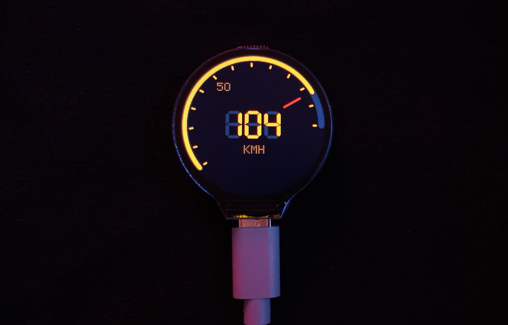

# POC of using Waveshare RP2040 LCD 1.28

This project serves as a proof of concept for creating a simple GUI interface using the Waveshare RP2040 LCD 1.28 module. The current functionality is minimal, focusing on the GUI.



## Source

- `code/code.ino`: Main entry file
- `code/utils.ino`: Reusable functions
- `code/TFTExtended.h`: Extends TFT_eSPI Library
- `code/DotMatrix.h`: 5x7 Dot-Matrix array

## Optional VSCode Setup

To streamline development with VSCode:

1. Install the Arduino Extension from the VSCode Marketplace.
2. Enable `arduino-cli` in the VSCode settings.

## Using Arduino IDE

To use the Arduino IDE:

1. Open the `code` directory directly in the Arduino IDE.
2. Ensure all necessary libraries and board configurations are installed.

## Dependencies

### Libraries

- **TFT_eSPI**: This library is essential for driving the TFT display.
  - Follow the documentation to configure `UserSetup.h` appropriately.

### Board Manager

Add the following URL to the Arduino Board Manager:

`https://github.com/earlephilhower/arduino-pico/releases/download/global/package_rp2040_index.json`


Install the `Raspberry Pi Pico/RP2040` from the Boards Manager.

## Installation

1. Clone the repository:

   ```sh
   git clone <repository-url>
   cd <repository-directory>
    ```
2. Open the project in the Arduino IDE or VSCode.
3. Install the required libraries:
4. In the Arduino IDE, go to Sketch -> Include Library -> Manage Libraries... and search for TFT_eSPI to install it.
Configure UserSetup.h in the TFT_eSPI library according to your display's specifications.

## Running the Project
1. Connect your Waveshare RP2040 LCD 1.28 module to the RP2040 board.
2. Open `code/code.ino` in the Arduino IDE or the `repository-root` in VSCode.
3. Select the appropriate board (Raspberry Pi Pico/RP2040) and port.
4. Upload the sketch to the board.

## References

- https://www.waveshare.com/wiki/RP2040-LCD-1.28
- https://github.com/earlephilhower/arduino-pico
- https://github.com/Bodmer/TFT_eSPI
- https://github.com/Microsoft/vscode-arduino

## Example User Setup for TFT Lib

To create a new file and extend the `User_Setup_Select.h`, follow these steps:

1. Navigate to `C:\Path\To\Arduino\libraries\TFT_eSPI\User_Setups\`.
2. Create a new file called `Setup303_Waveshare_RP2040_GC9A01.h`.
3. Open the newly created file and add the following code:

```cpp
#define USER_SETUP_ID 303
#define GC9A01_DRIVER
#define TFT_SPI_PORT 1
#define TFT_WIDTH 240
#define TFT_HEIGHT 240
#define TFT_MOSI 11  // It might be written as "SDA"
#define TFT_SCLK 10
#define TFT_CS 9     // Chip select control pin
#define TFT_DC 8     // Data Command control pin
#define TFT_RST 12   // Reset pin
#define TFT_BL 25    // LED back-light
#define TOUCH_CS -1  // Not used, prevents warning msg
#define TFT_BACKLIGHT_ON HIGH
#define LOAD_GLCD
#define LOAD_FONT2
#define LOAD_FONT4
#define LOAD_FONT6
#define LOAD_FONT7
#define LOAD_FONT8
#define LOAD_GFXFF
#define SMOOTH_FONT
#define SPI_FREQUENCY 27000000
#define SPI_READ_FREQUENCY 5000000

```
